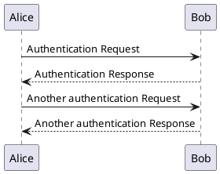

# PlantUML

Note: with Reveal 4 (maybe a conflict with highlight?) you may have to specify `language-plantuml` rather than `plantuml` - see https://github.com/reveal-plantuml/reveal-plantuml.github.io/issues/10

